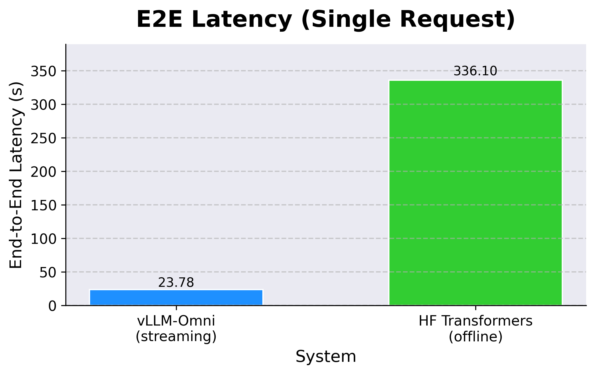
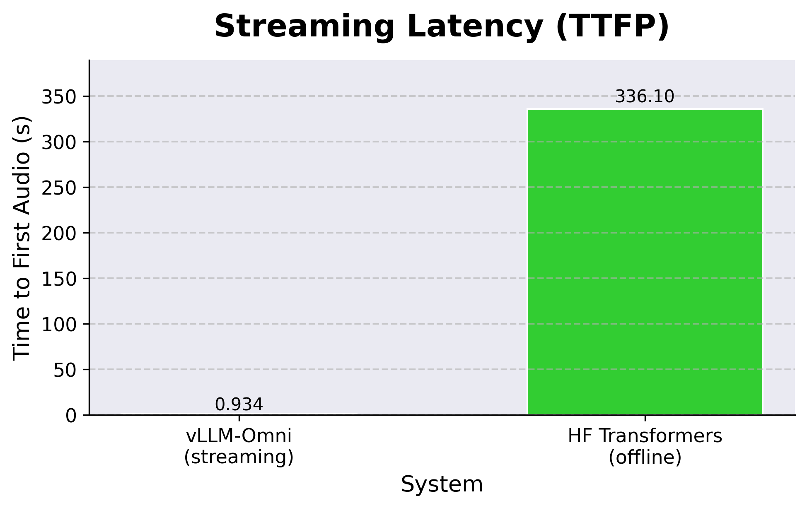
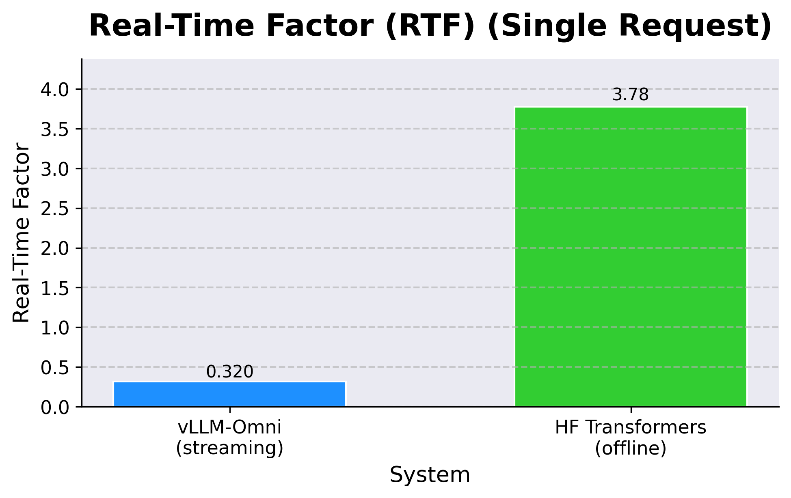

# Qwen3-Omni on vLLM-Omni: Streaming-First Performance Optimizations (Draft)

> This draft follows the writing style of the vLLM blog and keeps explicit placeholders for benchmark numbers and figures.
> You can directly replace all `[TBD]` fields with your final data and charts.

## Summary

Qwen3-Omni is a native multimodal model that can understand **text, audio, image, and video** inputs, and generate both **text** and **speech** outputs. In production serving, this architecture is naturally split into three stages:

- **Thinker**: multimodal understanding and text generation
- **Talker (+ Talker-MTP / code predictor path)**: converts semantic/text representations into codec tokens
- **Code2Wav**: decodes codec tokens into waveform audio

<p align="center">
  
  
  
</p>

<p align="center"><em>Single-request comparison: vLLM-Omni (Batch + CUDA Graph + Async Chunk + streaming) vs HF Transformers (offline).</em></p>

vLLM-Omni now supports running this full Qwen3-Omni pipeline end-to-end, and more importantly, supports stacking multiple latency/throughput optimizations that work together:

1. **Batching** improves GPU utilization stage by stage and increases overall throughput.
2. **CUDA Graph** reduces CPU launch overhead and decode-time jitter on stable shapes.
3. **Text streaming output** returns text tokens as soon as they are available, improving TTFT.
4. **Audio streaming output** returns audio chunks earlier, improving TTFP.
5. **Async chunk** overlaps compute and communication across stages, improving both TTFP and E2E.

Compared with the Transformers baseline in this setup:

- **E2E latency drops by 92.9%** (336.10s -> 23.78s, **14.1x faster**)
- **Time-to-first-audio (TTFP) drops by 99.7%** (336.10s -> 0.934s, **359.9x faster first packet**)
- **RTF drops by 91.5%** (3.776 -> 0.32, **11.8x lower real-time factor**)

This post walks through each optimization in the same order they are typically enabled in practice, then ends with a deployment playbook you can directly apply.

---

## Pipeline Batching Across Three Stages

### How stage-wise batching works

For Qwen3-Omni, batching is not a single switch at one model boundary. It is a pipeline-level optimization:

- requests are grouped per stage using `runtime.max_batch_size`
- each stage executes batch inference with its own scheduler/worker
- stage outputs are routed to downstream stages with per-request mapping preserved

This is especially important for multimodal speech generation, where bottlenecks may move between Thinker, Talker, and Code2Wav depending on concurrency and output length.

References:

- Thinker/Talker online batching: PR #438  
  <https://github.com/vllm-project/vllm-omni/pull/438>
- Code predictor batching: Issue #420 + PR #456  
  <https://github.com/vllm-project/vllm-omni/issues/420>  
  <https://github.com/vllm-project/vllm-omni/pull/456>
- Code2Wav batching RFC/implementation: Issue #1211 + PR #1246  
  <https://github.com/vllm-project/vllm-omni/issues/1211>  
  <https://github.com/vllm-project/vllm-omni/pull/1246>

### Stage-level batching results (before vs. after) `[TBD]`

Metrics: **E2E**, **TTFP**, **RTF**.

| Stage | Config | E2E (ms) | TTFP (ms) | RTF | Relative Change |
|---|---|---:|---:|---:|---:|
| Thinker | Batching Off | [TBD] | [TBD] | [TBD] | - |
| Thinker | Batching On | [TBD] | [TBD] | [TBD] | [TBD] |
| Talker + Talker-MTP | Batching Off | [TBD] | [TBD] | [TBD] | - |
| Talker + Talker-MTP | Batching On | [TBD] | [TBD] | [TBD] | [TBD] |
| Code2Wav | Batching Off | [TBD] | [TBD] | [TBD] | - |
| Code2Wav | Batching On | [TBD] | [TBD] | [TBD] | [TBD] |

---

## CUDA Graph on the Critical Decode Path

### Why CUDA Graph helps here

In decode-heavy serving, repeatedly launching many small kernels from CPU can become a visible overhead. CUDA Graph reduces this overhead by capturing and replaying stable execution graphs.

For Qwen3-Omni on vLLM-Omni:

- Thinker CUDA Graph support: PR #523  
  <https://github.com/vllm-project/vllm-omni/pull/523>
- Talker CUDA Graph support: PR #669  
  <https://github.com/vllm-project/vllm-omni/pull/669>

In stage configs, this is typically represented by `enforce_eager: false` for stages where graph capture is desired (commonly Thinker/Talker), while Code2Wav may keep eager mode depending on stage behavior.

### CUDA Graph results on top of batching `[TBD]`

Metrics: **E2E**, **TTFP**, **RTF**.

| Config | E2E (ms) | TTFP (ms) | RTF | Notes |
|---|---:|---:|---:|---|
| Batching On + CUDA Graph Off | [TBD] | [TBD] | [TBD] | `enforce_eager: true` |
| Batching On + CUDA Graph On | [TBD] | [TBD] | [TBD] | `enforce_eager: false` |
| Relative Change | [TBD] | [TBD] | [TBD] | [TBD] |

---

## Streaming Outputs: Lower TTFT, Earlier Audio

### Streaming mechanism and latency impact

Streaming changes the user-visible latency profile:

- **Text streaming output** emits text deltas as soon as text tokens are generated, reducing **TTFT**.
- **Audio streaming output** emits audio chunks earlier in the pipeline, reducing **TTFP**.

References:

- Basic streaming output support: PR #367  
  <https://github.com/vllm-project/vllm-omni/pull/367>
- For Qwen3-Omni audio behavior, stage2 scheduling/batching knobs (such as `max_num_batched_tokens`) can shift the tradeoff between first-packet latency and throughput.

### Streaming results on top of batching + CUDA Graph `[TBD]`

Metrics: **E2E**, **TTFT**, **TTFP**, **RTF**.

| Config | E2E (ms) | TTFT (ms) | TTFP (ms) | RTF | Notes |
|---|---:|---:|---:|---:|---|
| Streaming Off | [TBD] | [TBD] | [TBD] | [TBD] | Full response only |
| Text Streaming On, Audio Streaming Off | [TBD] | [TBD] | [TBD] | [TBD] | Text first |
| Text Streaming On, Audio Streaming On | [TBD] | [TBD] | [TBD] | [TBD] | Text + audio progressive |
| Relative Change | [TBD] | [TBD] | [TBD] | [TBD] | [TBD] |

---

## Async Chunk: Overlapping Stages for Faster First Packet

### Why async chunk matters for Qwen3-Omni

Without async chunk, stage handoff is closer to request-level synchronization. With async chunk, stage outputs are forwarded in chunks so downstream stages can start earlier:

- Thinker -> Talker: chunk-level hidden-state forwarding
- Talker -> Code2Wav: chunk-level codec forwarding
- Code2Wav: chunk decode and earlier packet emission

This creates cross-stage overlap and directly targets first-packet latency.

References:

- Async chunk feature PR: #727  
  <https://github.com/vllm-project/vllm-omni/pull/727>
- Async chunk RFC: #268  
  <https://github.com/vllm-project/vllm-omni/issues/268>
- Design document: `docs/design/feature/async_chunk_design.md`

### Visualizing the TTFP impact of async chunk

#### Async Chunk Off (sequential stage handoff)

<p align="center">
  <picture>
    <source media="(prefers-color-scheme: dark)" src="https://raw.githubusercontent.com/vllm-project/vllm-omni/refs/heads/main/docs/source/architecture/qwen3-omni-non-async-chunk.png">
    
  </picture>
</p>

#### Async Chunk On (chunked overlapping stage handoff)

<p align="center">
  <picture>
    <source media="(prefers-color-scheme: dark)" src="https://raw.githubusercontent.com/vllm-project/vllm-omni/refs/heads/main/docs/source/architecture/qwen3-omni-async-chunk.png">
    
  </picture>
</p>

What these figures show:

- **Top figure (async chunk off)**: stage handoff is more request-level and sequential; Talker/Code2Wav wait longer before useful data arrives, so first audio packet is delayed.
- **Bottom figure (async chunk on)**: intermediate outputs are forwarded chunk by chunk; downstream stages start earlier and overlap with upstream compute.
- This earlier overlap is exactly why **TTFP drops significantly** when async chunk is enabled, especially under concurrency.

### Async chunk results after stacking all previous features `[TBD]`

Stacking assumptions for this table:

- Batching enabled
- CUDA Graph enabled where applicable
- Streaming input/output enabled

Metrics: **E2E**, **TTFP**, **RTF**.

| Config | E2E (ms) | TTFP (ms) | RTF | Notes |
|---|---:|---:|---:|---|
| Async Chunk Off | [TBD] | [TBD] | [TBD] | Stacked baseline without async chunk |
| Async Chunk On | [TBD] | [TBD] | [TBD] | Stacked baseline with async chunk |
| Relative Change | [TBD] | [TBD] | [TBD] | [TBD] |

---

## Deployment Playbook: Enabling Qwen3-Omni Optimizations in vLLM-Omni

### 1) Serve Qwen3-Omni with the default 3-stage config

```bash
vllm serve Qwen/Qwen3-Omni-30B-A3B-Instruct \
  --omni \
  --port 8091 \
  --stage-configs-path vllm_omni/model_executor/stage_configs/qwen3_omni_moe.yaml
```

Notes:

- `runtime.max_batch_size` controls stage-level batching.
- Thinker/Talker commonly use `enforce_eager: false` for CUDA Graph paths.
- Code2Wav often remains eager (`enforce_eager: true`) depending on runtime behavior.

### 2) Enable async chunk

```bash
vllm serve Qwen/Qwen3-Omni-30B-A3B-Instruct \
  --omni \
  --port 8091 \
  --stage-configs-path vllm_omni/model_executor/stage_configs/qwen3_omni_moe_async_chunk.yaml
```

The async chunk config enables:

- top-level `async_chunk: true`
- async stage handoff processors (`thinker2talker_async_chunk`, `talker2code2wav_async_chunk`)

### 3) Enable streaming output in client requests

```bash
cd examples/online_serving/qwen3_omni

python openai_chat_completion_client_for_multimodal_generation.py \
  --query-type use_image \
  --stream
```

Optional:

- `--modalities text` for text-only output
- default / `--modalities audio` for text + audio output

### 4) Key config knobs (quick reference)

```yaml
async_chunk: true
stage_args:
  - stage_id: 0 # thinker
    runtime:
      max_batch_size: 64
    engine_args:
      enforce_eager: false
      max_num_batched_tokens: 32768
      custom_process_next_stage_input_func: vllm_omni.model_executor.stage_input_processors.qwen3_omni.thinker2talker_async_chunk

  - stage_id: 1 # talker
    runtime:
      max_batch_size: 64
    engine_args:
      enforce_eager: false
      max_num_batched_tokens: 32768
      custom_process_next_stage_input_func: vllm_omni.model_executor.stage_input_processors.qwen3_omni.talker2code2wav_async_chunk

  - stage_id: 2 # code2wav
    runtime:
      max_batch_size: 64
    engine_args:
      enforce_eager: true
      max_num_batched_tokens: 51200 # tune this for throughput vs first-packet tradeoff
```

### 5) Recommended benchmarking order

1. Transformers baseline
2. vLLM-Omni + batching
3. + CUDA Graph
4. + text/audio streaming
5. + async chunk (final stacked setup)

---

## References

- Style reference blog:  
  <https://blog.vllm.ai/2026/02/13/gb300-deepseek.html>
- vLLM-Omni repository:  
  <https://github.com/vllm-project/vllm-omni>
