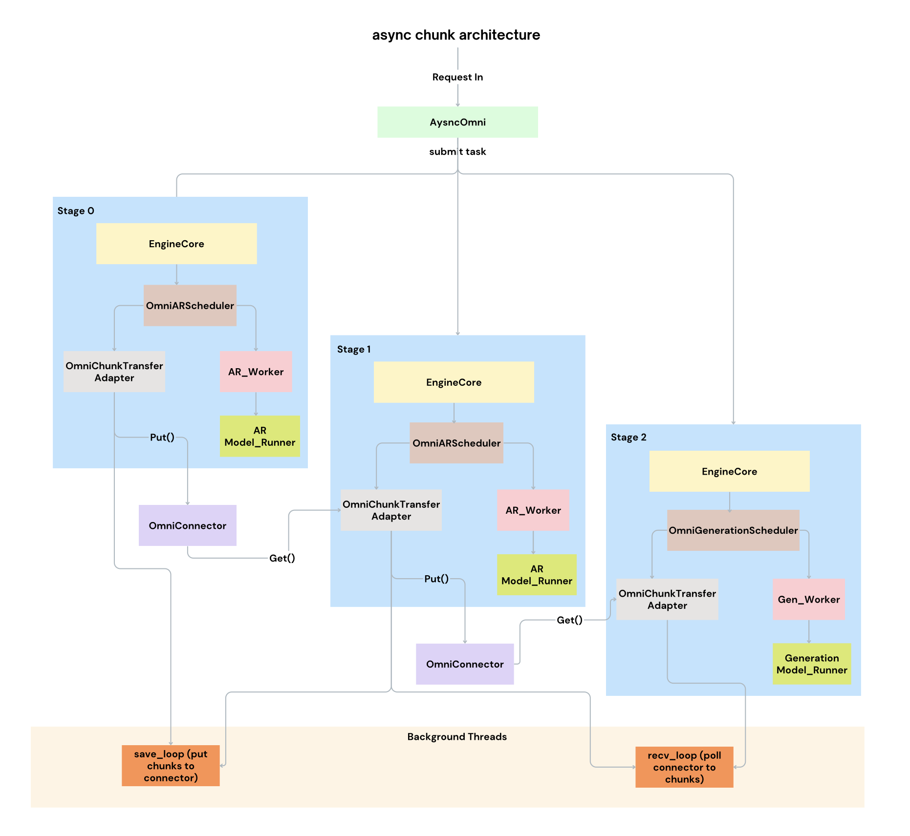

# Async Chunk: Making Multi-Stage Speech Generation Truly Streamable

In multi-stage multimodal systems like Qwen3-Omni, latency is shaped by the whole pipeline, not one model kernel.  
Async Chunk changes the serving pattern from "finish everything, then hand off" to "ship useful partial outputs immediately."

---

## Motivation: Why Async Chunk in Multi-Stage Multimodal Systems?

### 1) Full-buffer handoff creates long silence, amplifies first-packet latency

A typical speech path is **Thinker -> Talker -> Code2Wav**.  
When each stage waits for full upstream completion, first audio is delayed by stacked waiting time.

### 2) Model streaming ability is wasted without system streaming

The models like Qwen3-Omni can start producing useful outputs early, but if serving still buffers everything, that early work is invisible to users.

### 3) Concurrency amplifies queueing and jitter

At higher load, requests waiting on full upstream outputs occupy scheduler attention and hurt batch stability for everyone else.

#### Where It Matters Most
- Real-time voice assistants that care about "time to first sound"
- Multimodal applications that need fast spoken responses
- Online serving environments where first-packet stability is critical under concurrency

---

## Solution: Async Chunk Pipeline

We split the problem into three coordinated behaviors:

### 1) Chunk-level forwarding

Send partial upstream payloads as soon as they are available, instead of waiting for stage completion.

### 2) Non-blocking scheduling

Requests with missing upstream chunks move to `WAITING_FOR_CHUNK`; runnable requests continue to execute.

### 3) Controlled aggregation

For downstream speech generation (especially codec/audio stages), we aggregate where needed to avoid too many tiny kernels.

---

## Design: Key Components

### Chunk Transfer Adapter

Tracks per-request `put`/`get` chunk ids, merges partial payloads, and polls chunks asynchronously.

### Stage Schedulers

Before each scheduling step, schedulers call adapter hooks to:
- move chunk-waiting requests out of active queues,
- restore requests that now have data ready,
- keep queues healthy under concurrency.

### Stage Input Processors

Define how each stage converts upstream chunk payloads:
- Thinker -> Talker: embeddings/hidden states and token context
- Talker -> Code2Wav: codec code accumulation and chunked emission

---

## Request Lifecycle

Qwen3-Omni as an Example
1. A request enters Thinker.  
2. Thinker emits partial results; adapter sends chunk `0`, `1`, `2`... asynchronously.  
3. Talker polls adapter; if no chunk is ready, request stays in `WAITING_FOR_CHUNK`.  
4. Once enough chunk data is ready, Talker prefill starts and progresses chunk by chunk.  
5. Talker outputs codec chunks; Code2Wav consumes aggregated windows and emits audio packets.  
6. The final short tail is flushed when upstream marks `finished`.

The user hears audio earlier because downstream work starts before upstream is fully done.

---

## Performance Results & User Impact

TODO: add performance results

- **Lower first-audio latency:** downstream can begin earlier.
- **Higher stability under concurrency:** waiting requests stop blocking runnable work.
- **Better end-to-end smoothness:** chunk-aware scheduling reduces jitter and avoids bursty handoff.

Async Chunk is not just "send smaller pieces."  
It is a scheduler-and-transfer contract: **forward early, schedule only when ready, and flush tails safely.**
